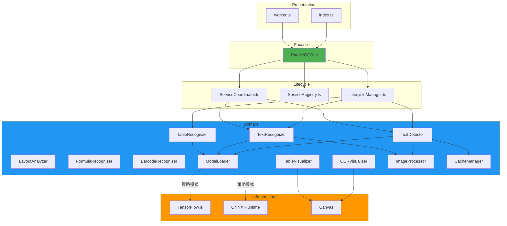
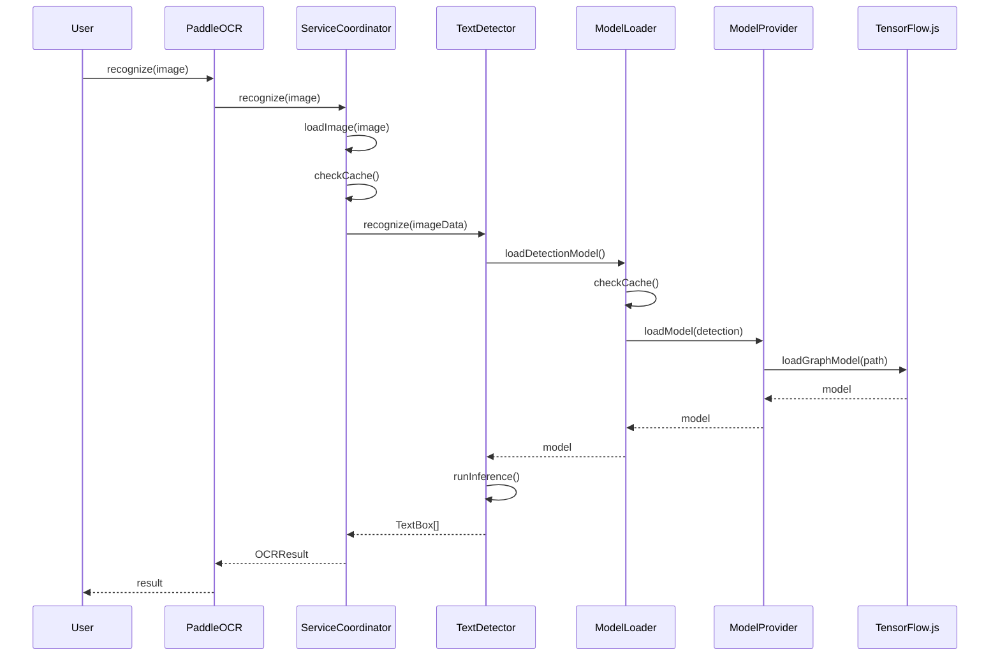
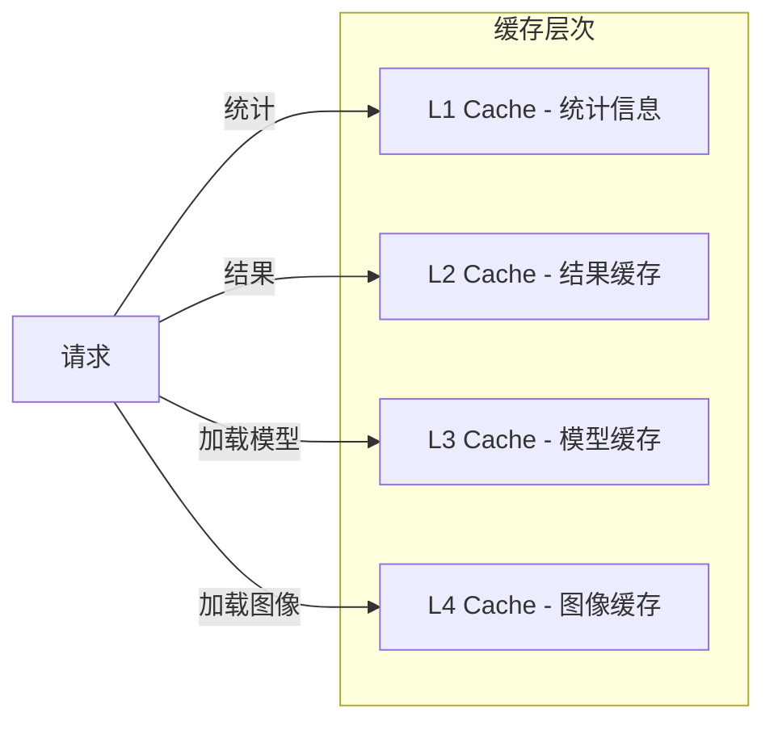
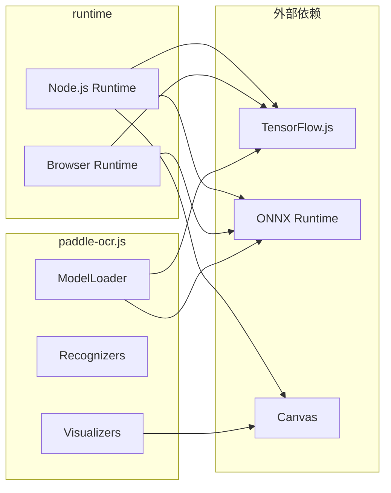

# paddle-ocr.js 架构设计文档

**设计师**: System Architect
**设计日期**: 2026-04-28
**架构风格**: 模块化分层架构 + DDD + 插件化
**版本**: v2.0 (优化版)

---

## 📋 设计目标

### 核心目标
1. **单一职责**: 每个模块职责明确,边界清晰
2. **高内聚低耦合**: 模块内部紧密, 模块间松散
3. **可扩展性**: 新增识别类型无需修改核心代码
4. **可测试性**: 每个模块可独立测试
5. **可维护性**: 代码易于理解和修改

### 质量目标
- 最大文件行数: < 500
- 模块间循环依赖: 0
- 测试覆盖率: > 50%
- TypeScript 错误: 0
- ESLint 警告: < 50

---

## 🏗️ 架构风格：模块化分层架构

```
┌─────────────────────────────────────────────────────────────┐
│                    Presentation Layer                       │
│  ┌──────────────────┐    ┌──────────────────┐               │
│  │   Public API     │    │   Worker API     │               │
│  │  (index.ts)      │    │   (worker.ts)    │               │
│  └──────────────────┘    └──────────────────┘               │
└─────────────────────────────────────────────────────────────┘
                           ↓
┌─────────────────────────────────────────────────────────────┐
│                     Facade Layer                            │
│  ┌──────────────────────────────────────────────────────┐  │
│  │                PaddleOCR (Facade)                      │  │
│  │  生命周期管理 + 服务协调 + API 暴露                   │  │
│  └──────────────────────────────────────────────────────┘  │
└─────────────────────────────────────────────────────────────┘
                           ↓
┌─────────────────────────────────────────────────────────────┐
│                   Application Layer                         │
│  ┌──────────┐  ┌──────────┐  ┌──────────┐  ┌──────────┐    │
│  │ Component│  │Component │  │Component │  │Component │    │
│  │ Manager  │  │Coordinator││Registry  │  │EventHandler│   │
│  │(Lifecycle│  │  (协调)   │  │(服务注册)│  │  (事件)   │    │
│  │  管理)   │  │          │  │          │  │          │    │
│  └──────────┘  └──────────┘  └──────────┘  └──────────┘    │
└─────────────────────────────────────────────────────────────┘
                           ↓
┌─────────────────────────────────────────────────────────────┐
│                     Domain Layer                            │
│                                                            │
│  ┌─────────────────┐  ┌─────────────────┐                │
│  │   Recognizers   │  │  Visualizers    │                │
│  │  (识别领域服务)  │  │ (可视化服务)    │                │
│  ├─────────────────┤  ├─────────────────┤                │
│  │ • TextDetector  │  │ • OCRVisualizer │                │
│  │ • TextRecognizer│  │ • TableVisualizer│               │
│  │ • TableRecognizer│ │ • FormulaVisualizer│             │
│  │ • LayoutAnalyzer│  │ • BarcodeVisualizer│             │
│  │ • FormulaRecognizer│               │                │
│  │ • BarcodeRecognizer│              │                │
│  └─────────────────┘  └─────────────────┘                │
│                                                            │
│  ┌──────────────┐  ┌──────────────┐  ┌──────────────┐    │
│  │  ModelLoader │  │   Cache      │  │    Image     │    │
│  │  (模型加载)   │  │  (缓存服务)   │  │  (图像处理)   │    │
│  └──────────────┘  └──────────────┘  └──────────────┘    │
└─────────────────────────────────────────────────────────────┘
                           ↓
┌─────────────────────────────────────────────────────────────┐
│              Infrastructure Layer                           │
│  ┌─────────────┐  ┌───────────────┐  ┌──────────────────┐  │
│  │ TensorFlow  │  │  ONNX Runtime │  │     Canvas       │  │
│  │   .js       │  │     -web       │  │      API         │  │
│  └─────────────┘  └───────────────┘  └──────────────────┘  │
└─────────────────────────────────────────────────────────────┘
```

---

## 📂 目录结构设计

重构后的目录结构：

```
src/
├── index.ts                      # 主入口 (导出 Public API)
├── worker.ts                     # Worker 入口 (Web Worker)
│
├── core/                         # 🎯 核心模块
│   ├── PaddleOCR.ts             # 门面类 (Facade)
│   ├── LifecycleManager.ts       # 生命周期管理
│   ├── ServiceRegistry.ts        # 服务注册表
│   ├── ServiceCoordinator.ts     # 服务协调器
│   └── EventHandler.ts           # 事件处理器
│
├── recognizing/                  # 🔍 识别领域服务
│   ├── Recognizer.ts            # 识别器基类 (interface)
│   ├── TextDetector.ts          # 文本检测
│   ├── TextRecognizer.ts        # 文本识别
│   ├── TableRecognizer.ts       # 表格识别
│   ├── LayoutAnalyzer.ts        # 布局分析
│   ├── FormulaRecognizer.ts     # 公式识别
│   ├── BarcodeRecognizer.ts     # 条码识别
│   └── RecognizerFactory.ts     # 识别器工厂
│
├── infrastructure/               # 🔧 基础设施层
│   ├── model/                   # 模型管理
│   │   ├── ModelLoader.ts       # 统一模型加载器
│   │   ├── ModelProvider.ts     # 模型提供者接口
│   │   ├── TensorFlowProvider.ts
│   │   └── ONNXProvider.ts
│   │
│   ├── cache/                   # 缓存服务
│   │   ├── ImageCache.ts
│   │   ├── ResultCache.ts
│   │   └── CacheManager.ts
│   │
│   ├── image/                   # 图像处理
│   │   ├── ImageLoader.ts
│   │   ├── ImageProcessor.ts
│   │   └── OCRImageData.ts
│   │
│   └── stats/                   # 统计服务
│       ├── StatsCollector.ts
│       └── StatsReporter.ts
│
├── visualizing/                  # 🎨 可视化领域服务
│   ├── Visualizer.ts            # 可视化器基类
│   ├── OCRVisualizer.ts
│   ├── TableVisualizer.ts
│   ├── FormulaVisualizer.ts
│   ├── BarcodeVisualizer.ts
│   └── VisualizerFactory.ts     # 可视化器工厂
│
├── exporting/                    # 📤 导出服务
│   ├── Exporter.ts
│   ├── HTMLExporter.ts
│   ├── JSONExporter.ts
│   └── MarkdownExporter.ts
│
├── styles/                       # 🎭 样式管理
│   ├── StyleManager.ts
│   ├── ColorPalette.ts
│   └── DefaultTheme.ts
│
├── errors/                       # ⚠️ 错误处理
│   ├── OCRError.ts
│   └── ErrorCode.ts
│
├── types/                        # 📝 类型定义
│   ├── core.ts                  # 核心类型
│   ├── recognition.ts          # 识别相关类型
│   ├── visualization.ts        # 可视化相关类型
│   ├── config.ts               # 配置类型
│   └── index.ts                # 统一导出
│
├── utils/                        # 🛠️ 工具类
│   ├── env.ts                   # 环境检测
│   ├── workerHelper.ts         # Worker 辅助
│   ├── logger.ts               # 日志工具
│   └── validators.ts           # 验证器
│
└── __tests__/                    # 🧪 测试目录
    ├── unit/
    │   ├── recognizing/
    │   ├── infrastructure/
    │   └── visualizing/
    ├── integration/
    └── fixtures/                # 测试数据
```

---

## 🔗 模块依赖关系

### 依赖规则 (The Dependency Rule)

```
依赖方向:
  Presentation → Facade → Application → Domain → Infrastructure
  
禁止:
  · Domain 不能依赖 Infrastructure 的具体实现
  · Infrastructure 不能依赖 Application 或 Domain
  · 循环依赖 (任何方向)
```

### 依赖图（Mermaid）



---

## 🎯 核心模块设计

### 1. PaddleOCR - 门面模式

**职责**: 作为外部唯一入口,协调内部服务

```typescript
// src/core/PaddleOCR.ts
export class PaddleOCR {
  // 服务协调器 (所有服务通过它访问)
  private coordinator: ServiceCoordinator
  
  constructor(options: PaddleOCROptions) {
    const registry = new ServiceRegistry(options)
    this.coordinator = new ServiceCoordinator(registry)
  }
  
  // 公共 API (委托给具体服务)
  async recognize(image: ImageSource): Promise<OCRResult> {
    return this.coordinator.recognize(image)
  }
  
  async recognizeTable(image: ImageSource): Promise<TableResult> {
    return this.coordinator.recognizeTable(image)
  }
  
  // 生命周期
  async init(): Promise<void> {
    await this.coordinator.initialize()
  }
  
  async dispose(): Promise<void> {
    await this.coordinator.dispose()
  }
  
  // 统计信息
  getStats(): OCRStats {
    return this.coordinator.getStats()
  }
}
```

**特点**:
- ✅ 单一职责: 只做协调和 API 暴露
- ✅ 简洁: ~100 行
- ✅ 易于测试: mock ServiceCoordinator 即可

---

### 2. ServiceCoordinator - 协调器

**职责**: 协调服务的调用顺序和依赖关系

```typescript
// src/core/ServiceCoordinator.ts
export class ServiceCoordinator {
  private lifecycle: LifecycleManager
  private registry: ServiceRegistry
  private stats: StatsCollector
  private cache: CacheManager
  
  constructor(registry: ServiceRegistry) {
    this.registry = registry
    this.lifecycle = new LifecycleManager(registry)
    this.stats = new StatsCollector()
    this.cache = new CacheManager(registry.getCacheConfig())
  }
  
  async initialize(): Promise<void> {
    await this.lifecycle.initialize()
  }
  
  async recognize(image: ImageSource): Promise<OCRResult> {
    this.stats.recordRequest()
    
    try {
      const imageData = await this.loadImage(image)
      const result = await this.registry.textDetector.detect(imageData)
      
      this.stats.recordSuccess()
      return result
    } catch (error) {
      this.stats.recordFailure()
      throw error
    }
  }
  
  private async loadImage(image: ImageSource): Promise<ImageData> {
    const imageData = await this.registry.imageLoader.load(image)
    
    // 检查缓存
    if (this.cache.hasImageData(imageData)) {
      this.stats.recordCacheHit()
      return this.cache.getImageData(imageData)
    }
    
    this.stats.recordCacheMiss()
    this.cache.cacheImageData(imageData)
    return imageData
  }
  
  async dispose(): Promise<void> {
    await this.lifecycle.dispose()
  }
  
  getStats(): OCRStats {
    return this.stats.getStats()
  }
}
```

**特点**:
- ✅ 统一协调逻辑
- ✅ 集中缓存和统计
- ✅ ~200 行

---

### 3. 识别器 - 统一接口

**基类接口**:
```typescript
// src/recognizing/Recognizer.ts
export interface Recognizer<TInput, TOutput> {
  // 生命周期
  init(): Promise<void>
  dispose(): Promise<void>
  
  // 核心功能
  recognize(input: TInput): Promise<TOutput>
  
  // 配置
  get isInitialized(): boolean
}
```

**具体实现**:
```typescript
// src/recognizing/TextDetector.ts
export class TextDetector implements Recognizer<ImageData, TextBox[]> {
  private modelLoader: ModelLoader
  private isInitialized = false
  
  constructor(private options: PaddleOCROptions) {
    this.modelLoader = new ModelLoader(options)
  }
  
  async init(): Promise<void> {
    if (this.isInitialized) return
    
    this.model = await this.modelLoader.loadDetectionModel()
    this.isInitialized = true
  }
  
  async recognize(imageData: ImageData): Promise<TextBox[]> {
    if (!this.isInitialized) {
      await this.init()
    }
    
    // 使用 ModelLoader 加载的模型进行检测
    return this.detectInner(imageData)
  }
  
  async dispose(): Promise<void> {
    if (this.model) {
      this.model.dispose?.()
      this.model = null
    }
    this.isInitialized = false
  }
}
```

**优点**:
- ✅ 所有识别器统一接口
- ✅ 易于单元测试
- ✅ 易于扩展新识别器

---

### 4. ModelLoader - 统一模型加载

**职责**: 统一管理所有模型的加载、缓存和策略切换

```typescript
// src/infrastructure/model/ModelLoader.ts
export class ModelLoader {
  private cache = new Map<string, any>()
  private provider: ModelProvider
  
  constructor(private options: PaddleOCROptions) {
    // 根据配置选择策略
    if (options.useONNX) {
      this.provider = new ONNXProvider(options)
    } else {
      this.provider = new TensorFlowProvider(options)
    }
  }
  
  async loadDetectionModel(): Promise<any> {
    const cacheKey = 'detection'
    
    if (this.cache.has(cacheKey)) {
      return this.cache.get(cacheKey)
    }
    
    const model = await this.provider.loadModel('detection', {
      modelName: this.options.detectionModel,
      language: this.options.language
    })
    
    this.cache.set(cacheKey, model)
    return model
  }
  
  async loadRecognitionModel(): Promise<any> {
    const cacheKey = 'recognition'
    
    if (this.cache.has(cacheKey)) {
      return this.cache.get(cacheKey)
    }
    
    const model = await this.provider.loadModel('recognition', {
      modelName: this.options.recognitionModel,
      language: this.options.language
    })
    
    this.cache.set(cacheKey, model)
    return model
  }
  
  async loadTableModel(): Promise<any> {
    return this.provider.loadModel('table', {
      modelName: 'TableRec'
    })
  }
  
  // ... 其他模型加载方法
  
  dispose(): void {
    for (const model of this.cache.values()) {
      model.dispose?.()
    }
    this.cache.clear()
  }
}
```

**特点**:
- ✅ 策略模式 (TensorFlow.js ↔ ONNX Runtime)
- ✅ 统一缓存管理
- ✅ 模型路径统一构建

---

### 5. Visualizer - 可视化器基类

```typescript
// src/visualizing/Visualizer.ts
export abstract class Visualizer<T> {
  protected canvas: HTMLCanvasElement | null = null
  protected ctx: CanvasRenderingContext2D | null = null
  
  constructor(options?: VisualizerOptions) {
    this.initCanvas(options?.canvas)
  }
  
  abstract visualize(data: T): HTMLCanvasElement | string
  
  protected initCanvas(canvas?: HTMLCanvasElement): void {
    this.canvas = canvas || document.createElement('canvas')
    this.ctx = this.canvas.getContext('2d')
  }
  
  protected clear(): void {
    if (this.ctx) {
      this.ctx.clearRect(0, 0, this.canvas.width, this.canvas.height)
    }
  }
}

// src/visualizing/OCRVisualizer.ts
export class OCRVisualizer extends Visualizer<OCRResult> {
  visualize(result: OCRResult): HTMLCanvasElement {
    this.clear()
    
    // 绘制文本框
    for (const box of result.textDetection) {
      this.drawTextBox(box)
    }
    
    // 绘制文本内容
    for (const line of result.textRecognition) {
      this.drawText(line)
    }
    
    return this.canvas
  }
  
  private drawTextBox(box: TextBox): void {
    // 绘制逻辑...
  }
  
  private drawText(line: TextLine): void {
    // 文字绘制逻辑...
  }
}
```

---

## 📊 数据流设计

### 典型识别流程



### 缓存策略



---

## 🔒 安全设计

### 1. 输入验证
```typescript
// src/utils/validators.ts
export class ImageValidator {
  static validate(source: ImageSource): ImageSource {
    if (!source) {
      throw new OCRError('Image source is required', ErrorCode.INVALID_INPUT)
    }
    
    // 添加更多验证...
    return source
  }
}
```

### 2. 资源限制
```typescript
// 配置限制
export const DEFAULT_LIMITS = {
  maxImageSize: 4096 * 4096,  // 16MP
  maxConcurrentRequests: 10,
  maxCacheSize: 100,  // MB
}
```

### 3. 错误边界
```typescript
// src/core/ServiceCoordinator.ts
async recognize(image: ImageSource): Promise<OCRResult> {
  try {
    // ... 识别逻辑
  } catch (error) {
    // 统一错误处理
    throw new OCRError(
      'Recognition failed',
      ErrorCode.RECOGNITION_FAILED,
      'recognize',
      error
    )
  }
}
```

---

## 🚀 部署架构

### 依赖关系图



### 配置示例

```typescript
// Node.js 环境
const ocr = new PaddleOCR({
  modelPath: './models',
  useTensorflow: true,
  enableGPU: false,  // Node.js 不支持 GPU
})

// Browser 环境
const ocr = new PaddleOCR({
  modelPath: '/models',
  useWasm: true,
  enableGPU: true  // WebGL 加速
})

// CI 环境
const ocr = new PaddleOCR({
  modelPath: './test-models',
  enableCache: false,  // 测试环境不使用缓存
  enableGPU: false    // CI 环境简单配置
})
```

---

## 📈 性能优化设计

### 1. 惰性加载
```typescript
// 只在需要时初始化识别器
class ServiceRegistry {
  private _textDetector: TextDetector | null = null
  
  get textDetector(): TextDetector {
    if (!this._textDetector) {
      this._textDetector = new TextDetector(this.options)
    }
    return this._textDetector
  }
}
```

### 2. 对象池
```typescript
// 复用 Canvas 对象
class CanvasPool {
  private pool: HTMLCanvasElement[] = []
  
  acquire(): HTMLCanvasElement {
    return this.pool.pop() || document.createElement('canvas')
  }
  
  release(canvas: HTMLCanvasElement): void {
    this.pool.push(canvas)
  }
}
```

### 3. 批处理
```typescript
// 批量识别优化
async recognizeBatch(images: ImageSource[]): Promise<OCRResult[]> {
  const batchSize = this.options.batchSize || 1
  
  for (let i = 0; i < images.length; i += batchSize) {
    const batch = images.slice(i, i + batchSize)
    await Promise.all(batch.map(img => this.recognize(img)))
  }
  
  return results
}
```

---

## ✅ 迁移路径

### 渐进式迁移策略

**Phase 1: 基础重构** (不影响功能)
1. 创建新的目录结构
2. 重命名现有文件
3. 更新导入路径
4. 测试验证

**Phase 2: 核心优化** (影响代码结构)
1. 创建 ModelLoader 统一加载
2. 创建 ServiceCoordinator 协调
3. 更新所有识别器
4. 测试验证

**Phase 3: 高级重构** (影响架构)
1. 拆分可视化模块
2. 创建门面模式
3. 重命名和整理
4. 测试验证

**Phase 4: 最终验证**
1. 全量测试
2. 性能基准测试
3. 文档更新
4. 提交发布

---

**文档生成**: System Architect
**下一步**: 代码简化执行 (Simplify)
**OH-NO 建议**: 哦不！这个架构看起来很复杂啊！但至少比现在清楚多了。迁移分4个阶段走，每个阶段都要测试啊！
