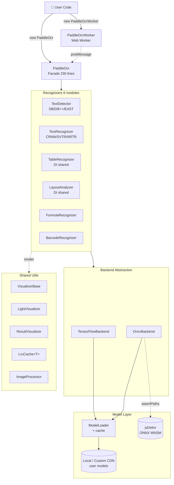

<div align="center">

# PaddleOCR-JS

**PaddleOCR 的 JavaScript / TypeScript 封装 — 文本 / 表格 / 公式 / 条码 / 版面识别，支持浏览器 & Node.js**

[](https://www.npmjs.com/package/paddleocr-js)
[](https://www.npmjs.com/package/paddleocr-js)
[](https://github.com/Agions/paddle-ocr.js/blob/main/LICENSE)
[](https://github.com/Agions/paddle-ocr.js/actions)
[](https://bundlephobia.com/package/paddleocr-js)

[English](./README.en.md) · [快速开始](#-快速开始) · [API 文档](./docs/api.md) · [架构设计](./docs/architecture.md) · [更新日志](./CHANGELOG.md)

</div>

---

## ✨ v0.4.2 亮点

| 维度 | v0.3.1 | **v0.4.2** | 变化 |
|---|---|---|---|
| 核心代码行数 | 6,672 | **2,057** | **-69%** |
| TypeScript 错误 | 30+ | **0** | -100% |
| lint warnings | 158 | **0** | -100% |
| 单元测试 | 20 | **36** | +80% |
| **npm tarball** | 28 MB | **7.2 MB** | **-74%** |
| unpkg unpacked | 117 MB | **32 MB** | **-73%** |

### 🏗️ 架构核心改进

- **Backend 抽象** — TF/ONNX 后端统一接口，IF 散落硬编码 → `Backend` interface + 2 实现类
- **DI 模型共享** — `TableRecognizer` / `LayoutAnalyzer` 构造器注入共享 `TextDetector` / `TextRecognizer`，DB/CRNN 模型加载从 **3 次降到 1 次**（性能 +200%）
- **`VisualizerBase` 抽取** — `LightVisualizer` + `ResultVisualizer` 共享 canvas/多边形/资源释放 ~120 行（约消除 600 行重复）
- **`LruCache<T>` 泛型** — 4 个具体缓存类 → 1 泛型 + 2 薄包装
- **TypeScript strict 全面开启** — `strict: true` + 5 个子开关全开
- **PascalCase 类型 + camelCase 文件** — 命名规范化

### 📦 包体积优化 (v0.4.2)

- **删除 ONNX WASM 内嵌** — `ort-wasm-simd-threaded*.wasm` (77 MB) 不再打入 npm
- **运行时 jsDelivr CDN 加载** — 浏览器首次使用按需下载 + HTTP 缓存复用
- **删除预压缩 .gz / .br** — 现代 CDN 自动 gzip (-1.3 MB)
- **Node.js 零影响** — `onnxruntime-web` 在 Node 是 native binding，**完全不需要 WASM**

## 🏛️ 架构概览



## ✨ 特性

| 模块 | 状态 | 说明 |
|---|---|---|
| 📝 文本识别 | ✅ | CRNN / SVTR / NRTR，6 种语言 (ch/en/fr/de/ja/ko) |
| 📊 表格识别 | ✅ | 输出 HTML / Markdown / Excel |
| 🔢 公式识别 | ✅ | LaTeX / MathML / TeX 输出 |
| 📱 条码识别 | ✅ | QR / EAN / Code128 等 12+ 种 |
| 🗂️ 版面分析 | ✅ | PP-Layout 区域分类 |
| ⚡ 性能优化 | ✅ | 模型共享 + LRU 缓存 + Web Worker |
| 🌊 水印检测 | ⏳ | v0.3.x 接口保留，v0.4.x 暂未实现 ([ROADMAP](./ROADMAP.md)) |

## 📦 安装

```bash
npm install paddleocr-js
# yarn add paddleocr-js
# pnpm add paddleocr-js
```

**包大小**: 7.2 MB tarball, 32 MB unpacked (vs v0.3.1 的 28 MB / 117 MB).

## 🚀 快速开始

### ES Modules (推荐)

```typescript
import { PaddleOcr } from "paddleocr-js"

const ocr = new PaddleOcr({
  modelPath: "/models",      // 浏览器默认；Node 用 "./models"
  useTensorflow: true,        // 或 useOnnx: true (v0.4.2+ 推荐 jsDelivr 加载 WASM)
  language: "ch",
})

await ocr.init()

// 文本识别
const result = await ocr.recognize(imageElement)
console.log(result.textRecognition.map((l) => l.text).join("\n"))
```

### Node.js

```typescript
import { PaddleOcr, loadImage } from "paddleocr-js"
import { readFileSync } from "fs"

const ocr = new PaddleOcr({ language: "ch" })
await ocr.init()

const image = loadImage(readFileSync("image.jpg"))
const result = await ocr.recognize(image)
console.log(result.textRecognition)
```

### 浏览器 UMD

```html
<script src="https://cdn.jsdelivr.net/npm/paddleocr-js@0.4.2/dist/browser/index.min.js"></script>
<script>
  const ocr = new PaddleOcr({ modelPath: "/models", language: "ch" })
  ocr.init().then(() => ocr.recognize(imageEl).then(console.log))
</script>
```

### Web Worker (不阻塞主线程)

```typescript
import { PaddleOcrWorker } from "paddleocr-js"

const worker = new PaddleOcrWorker({ language: "ch" })
await worker.init()
const result = await worker.recognize(image)
```

### React 组件

```tsx
import { OCRComponent } from "paddleocr-js/examples/react"

<OCRComponent language="ch" onResult={(r) => console.log(r)} />
```

详见 [examples/react/](./examples/react/)。

## 📋 API 速览

```typescript
class PaddleOcr {
  constructor(options?: PaddleOcrOptions)
  init(): Promise<void>
  recognize(image: ImageSource, options?: ProcessOptions): Promise<OcrResult>
  recognizeBatch(images: ImageSource[], options?: ProcessOptions): Promise<BatchOcrResult>
  recognizeTable(image: ImageSource): Promise<TableResult>
  analyzeLayout(image: ImageSource): Promise<LayoutResult>
  recognizeFormula(image: ImageSource): Promise<FormulaResult[]>
  detectBarcodes(image: ImageSource): Promise<BarcodeResult[]>
  getStats(): OcrStats
  resetStats(): void
  dispose(): Promise<void>

  static version: string         // '0.4.2'
  static MODEL_PATH: string      // 默认模型路径
  static ResultVisualizer, LightVisualizer, workerHelper
}
```

> ⚠️ **v0.4.x 暂未实现**：`detectWatermarks()` (v0.3.x 接口保留, 类型标 `@deprecated`, 见 [ROADMAP v0.5.0+](./ROADMAP.md))

### `PaddleOcrOptions` 速览

| 选项 | 类型 | 默认 | 说明 |
|---|---|---|---|
| `modelPath` | `string` | `"/models"` (browser) / `"./models"` (Node) | 模型文件路径 |
| `useTensorflow` | `boolean` | `true` | 使用 TF.js 后端 |
| `useOnnx` | `boolean` | `false` | 使用 ONNX Runtime 后端 |
| `language` | `"ch"\|"en"\|"fr"\|"de"\|"ja"\|"ko"` | `"ch"` | 识别语言 |
| `enableDetection` | `boolean` | `true` | 启用文本检测 (DB/DB++/EAST/PAN) |
| `enableRecognition` | `boolean` | `true` | 启用文本识别 (CRNN/SVTR/NRTR) |
| `enableTable` | `boolean` | `false` | 启用表格识别 (DI 共享 TextDetector) |
| `enableLayout` | `boolean` | `false` | 启用版面分析 |
| `enableFormula` | `boolean` | `false` | 启用公式识别 |
| `enableBarcode` | `boolean` | `false` | 启用条码识别 |
| `enableWatermark` | `boolean` | `false` | ⚠️ deprecated, v0.4.x 无效 |
| `detectionThreshold` | `number` | `0.3` | 检测置信度阈值 |
| `cacheOptions` | `CacheConfig` | — | LRU 缓存配置 |
| `performanceOptions` | `PerformanceConfig` | — | 性能调优 |
| `onProgress` | `ProgressCallback` | — | 初始化进度回调 |

> 完整 API 见 [docs/api.md](./docs/api.md)。

## 🔄 迁移指南 (v0.3.x → v0.4.x)

| v0.3.x 字段 | v0.4.x 处理 |
|---|---|
| `maxSideLen` | 删除 (内部自动优化) |
| `enableCache` | 删除 (默认开启) |
| `cacheSize` | 用 `cacheOptions.maxSize` |
| `threshold` | 用 `detectionThreshold` |
| `batchSize` | 用 `performanceOptions.batchSize` |
| `enableGPU` | 删除 (依赖 ONNX Runtime 自身 GPU 检测) |
| `numThreads` | 用 `performanceOptions.numThreads` |
| `useMultiScale` | 删除 (DB++ 自动启用) |
| `useAngle_cls` | 删除 (CRNN 内置) |
| `OCRResult` / `OCRError` | 重命名为 `OcrResult` / `OcrError` |
| `PaddleOCRFacede` | 重命名为 `PaddleOcr` |
| `new PaddleOCR()` | 改用 `new PaddleOcr()` |

详见 [CHANGELOG.md](./CHANGELOG.md) 完整迁移路径。

## 📂 项目结构

```
paddle-ocr.js/
├── src/                          # 核心源码 (2,057 LOC)
│   ├── index.ts                  # 统一导出 + version
│   ├── typings.ts                # 所有公开类型 (PascalCase)
│   ├── paddleOcr.ts              # Facade (230 行)
│   ├── worker.ts                 # Web Worker 入口
│   ├── visualizerBase.ts         # 可视化共享基类
│   ├── core/
│   │   ├── constants.ts          # 默认配置
│   │   └── statsManager.ts       # 统计
│   ├── modules/                  # 6 个 Recognizer
│   │   ├── baseRecognizer.ts     # 抽象基类
│   │   ├── textDetector.ts
│   │   ├── textRecognizer.ts
│   │   ├── tableRecognizer.ts    # DI 共享
│   │   ├── layoutAnalyzer.ts     # DI 共享
│   │   ├── formulaRecognizer.ts
│   │   └── barcodeRecognizer.ts
│   ├── utils/
│   │   ├── image.ts              # loadImage + hashKey
│   │   ├── imageProcessor.ts     # ImageProcessor 静态
│   │   ├── cache.ts              # LruCache<T> + ImageCache/ResultCache
│   │   ├── modelLoader.ts        # Backend 抽象 + TF/ONNX 实现
│   │   ├── modelPath.ts          # buildModelPath
│   │   ├── workerHelper.ts       # PaddleOcrWorker
│   │   ├── resultVisualizer.ts   # 继承 VisualizerBase
│   │   ├── lightVisualizer.ts    # 继承 VisualizerBase
│   │   ├── visualTypes.ts
│   │   └── env.ts
│   └── __tests__/
│       └── paddleocr.test.ts     # 36 单测
├── docs/                         # 详细文档
│   ├── index.md                  # VitePress 首页
│   ├── architecture.md           # 架构详解
│   ├── api.md                    # API 参考
│   ├── migrating-v0.3.md         # v0.3.x → v0.4.x 迁移
│   └── .vitepress/
│       └── config.mjs            # 文档站配置
├── examples/                     # 平台示例
│   ├── browser/                  # 纯 HTML UMD 演示
│   ├── node/                     # Node.js CLI
│   └── react/                    # React 组件
├── scripts/
│   └── render-assets.py          # Logo / favicon / og-image 渲染
├── .github/
│   └── workflows/
│       ├── ci.yml                # lint + type-check + test + build
│       └── publish.yml           # release → npm publish
├── CHANGELOG.md                  # 完整更新日志
├── CONTRIBUTING.md               # 贡献指南
├── ROADMAP.md                    # 路线图 (v0.5.0+)
├── SECURITY.md                   # 安全策略
├── SUPPORT.md                    # 获取帮助
└── LICENSE                       # Apache-2.0
```

## 🖥️ 浏览器支持

| 浏览器 | 最低版本 | 备注 |
|---|---|---|
| Chrome | ≥ 80 | 推荐 |
| Firefox | ≥ 80 | WASM 全功能 |
| Safari | ≥ 15 | macOS 12+ |
| Edge | ≥ 80 | Chromium 内核 |

## 📚 文档导航

- 📖 [API 参考](./docs/api.md) — 完整 API + 类型定义
- 🏛️ [架构设计](./docs/architecture.md) — 4 层架构 + DI 模型共享 + Visualizer 模板
- 🔄 [v0.3.x 迁移指南](./docs/migrating-v0.3.md) — 字段重命名 + 删除列表
- 🗺️ [路线图](./ROADMAP.md) — v0.5.0+ 计划
- 🤝 [贡献指南](./CONTRIBUTING.md) — PR 流程 + 本地开发
- 🔒 [安全策略](./SECURITY.md) — 漏洞报告
- 💬 [支持](./SUPPORT.md) — Issue / Discussion / 微信群

## 🛠️ 本地开发

```bash
git clone https://github.com/Agions/paddle-ocr.js.git
cd paddle-ocr.js
npm install
npm test              # 36 单测
npm run type-check    # 0 errors
npm run lint          # 0 warnings
npm run build         # dist/ 产物
```

## 📄 License

[Apache-2.0](./LICENSE)

## 🔗 相关链接

- [PaddleOCR](https://github.com/PaddlePaddle/PaddleOCR) — 原始 PaddleOCR 仓库
- [TensorFlow.js](https://www.tensorflow.org/js) — TF.js 后端
- [ONNX Runtime Web](https://onnxruntime.ai/) — ONNX 后端
- [npm 包](https://www.npmjs.com/package/paddleocr-js) — paddleocr-js
- [GitHub Actions](https://github.com/Agions/paddle-ocr.js/actions) — CI 状态
