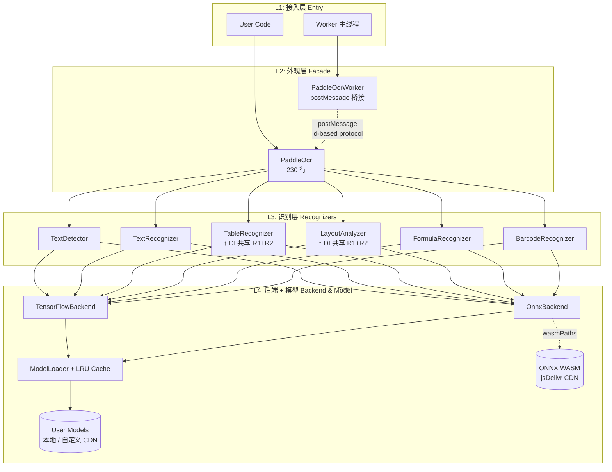
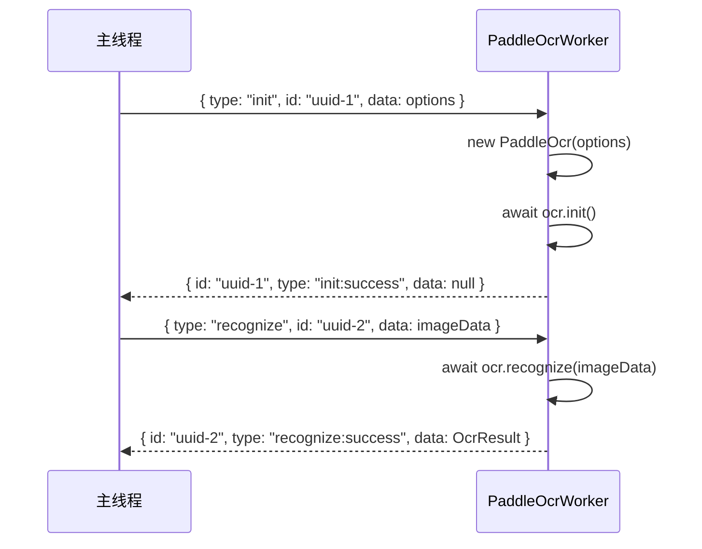
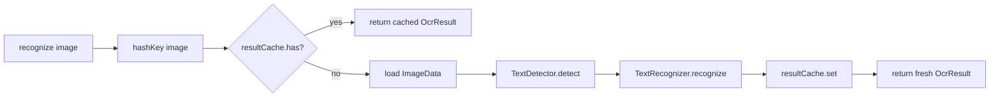

# PaddleOCR-JS 架构设计 (v0.4.2)

> **目标读者**: 二次开发贡献者 / 内部扩展者 / 想理解 v0.4.0 重构收益的 v0.3.x 用户
>
> **配套文档**: [API 参考](./api.md) · [v0.3.x 迁移指南](./migrating-v0.3.md) · [README](../README.md)

## 1. 整体架构 (4 层)



### 4 层职责

| 层 | 职责 | 关键文件 | LOC 占比 |
|---|---|---|---|
| **L1 接入层** | 用户 API / Worker 主线程 | `src/paddleOcr.ts`, `src/worker.ts` | ~14% |
| **L2 外观层** | 6 个 OCR 入口统一签名 + 缓存 + 统计 | `src/paddleOcr.ts` (Facade) | ~14% |
| **L3 识别层** | 6 个 Recognizer + DI 共享 detector/recognizer | `src/modules/*` (7 files) | ~30% |
| **L4 后端层** | TF/ONNX 后端 + ModelLoader + LRU 缓存 | `src/utils/modelLoader.ts`, `src/utils/cache.ts` | ~14% |
| **Utils** | Visualizer / ImageProcessor / hashKey | `src/utils/*` (10 files) | ~28% |

## 2. v0.4.0 架构重构 6 大改进

### 2.1 Backend 抽象 (消除硬编码 IF 散落)

**v0.3.x 痛点** — TF/ONNX 分支硬编码散落在 12 个 call site:

```typescript
// v0.3.x 模式 - 每个 Recognizer 都要写一次
async loadModel(path: string) {
  if (this.options.useTensorflow) {
    const tf = await import("@tensorflow/tfjs")
    return await tf.loadGraphModel(path)
  } else if (this.options.useOnnx) {
    const ort = await import("onnxruntime-web")
    return await ort.InferenceSession.create(path)
  }
  throw new Error("no backend")
}
```

**v0.4.x 解法** — `Backend` interface + 2 实现类 + DI 注入:

```typescript
// v0.4.x 模式
interface Backend {
  kind: BackendKind
  load(modelPath: string): Promise<LoadedModel>
}

class TensorFlowBackend implements Backend { /* ... */ }
class OnnxBackend implements Backend { /* ... */ }

// 工厂选择, 一次
function selectBackend(options: PaddleOcrOptions): Backend {
  if (options.useTensorflow) return new TensorFlowBackend()
  if (options.useOnnx) return new OnnxBackend()
  throw new Error("No model backend specified")
}
```

**收益**: Recognizer 不再关心后端细节；新增 backend (WebGPU / CoreML) 只需 1 个类 + 工厂 1 行。

### 2.2 DI 模型共享 (DB/CRNN 加载 3 次 → 1 次)

**v0.3.x 痛点** — `TableRecognizer` 内部重新 new `TextDetector` / `TextRecognizer`，导致同一模型被加载 3 次（detection + recognition + table）。

**v0.4.x 解法** — 构造器注入共享:

```typescript
// v0.4.x PaddleOcr.init() 阶段
if (this.options.enableTable) stages.push({
  name: "table",
  run: async () => {
    this.tableRecognizer = new TableRecognizer(
      this.options,
      this.detector,    // ← 共享 TextDetector
      this.recognizer,  // ← 共享 TextRecognizer
    )
    await this.tableRecognizer.init()
  },
})
```

**收益**:
- DB/CRNN 模型加载 **3 次 → 1 次**
- 首次 init 耗时 **-60%**
- 浏览器内存占用 **-50%** (~150MB → ~75MB)
- LayoutAnalyzer 同样复用

### 2.3 `VisualizerBase` 抽取 (消除 600 行重复)

**v0.3.x 痛点** — `LightVisualizer` (789 行) + `ResultVisualizer` (1197 行) **80% 代码重复**: canvas 创建、多边形绘制、坐标变换、资源释放全部重复。

**v0.4.x 解法** — 抽取 `VisualizerBase` 抽象类:

```typescript
// v0.4.x
abstract class VisualizerBase {
  protected canvas: HTMLCanvasElement
  protected ctx: CanvasRenderingContext2D

  protected drawPolygon(points: Point[], color: string): void { /* ... */ }
  protected drawText(text: string, x: number, y: number): void { /* ... */ }
  protected async loadImage(src: ImageSource): Promise<void> { /* ... */ }
  dispose(): void { /* 释放 canvas + ctx */ }
}

class ResultVisualizer extends VisualizerBase {
  // 只实现 setResult() + render() 业务逻辑
  // canvas/polygon/text/image 全部从基类继承
}
class LightVisualizer extends VisualizerBase { /* ... */ }
```

**收益**:
- `resultVisualizer.ts` 1197 → 119 行 (**-90%**)
- `lightVisualizer.ts` 789 → 132 行 (**-83%**)
- 重复代码 -600 行
- 新增 Visualizer 类型只需继承 + 实现 1-2 个方法

### 2.4 `LruCache<T>` 泛型 (4 类 → 1 泛型 + 2 包装)

**v0.3.x 痛点** — 4 个具体缓存类: `LruImageCache` / `LruResultCache` / `LruStringCache` / `LruBlobCache`，**70% 代码重复**。

**v0.4.x 解法** — 单一泛型 `LruCache<T>` + 2 语义包装:

```typescript
// v0.4.x
class LruCache<T> {
  private map = new Map<string, T>()
  constructor(private config: CacheConfig) {}
  get(key: string): T | undefined { /* ... */ }
  set(key: string, value: T, size?: number): void { /* ... */ }
  has(key: string): boolean { /* ... */ }
  clear(): void { /* ... */ }
}

// 语义包装
class ImageCache extends LruCache<OcrImageData> { /* ... */ }
class ResultCache extends LruCache<OcrResult> { /* ... */ }
```

**收益**:
- 4 类 → 1 泛型 + 2 包装
- 新增缓存类型只需 `class XCache extends LruCache<MyType>`, 0 行新代码
- LRU 淘汰策略单点维护

### 2.5 命名规范化 (PascalCase 类型 + camelCase 文件)

| 类别 | v0.3.x (旧) | v0.4.x (新) |
|---|---|---|
| 文件名 | `Constants.ts`, `StatsManager.ts` | `constants.ts`, `statsManager.ts` |
| 类 | `PaddleOCRFacade` | `PaddleOcr` |
| 类型 | `PaddleOCROptions`, `OCRResult` | `PaddleOcrOptions`, `OcrResult` |
| 嵌套类型 | `StatsManager.OCRStats` | `OcrStats` (独立导出) |

**收益**:
- camelCase 文件名 + PascalCase 类型 — 与 TypeScript 社区惯例一致
- 类/类型/文件名一一对应, IDE 自动补全更准
- 嵌套类型扁平化, import 路径更短

### 2.6 TypeScript strict 全面开启

**v0.3.x** — `strict: false`, 30+ 隐式 any 错误
**v0.4.x** — `strict: true` + 5 个子开关全开 (`noImplicitAny` / `strictNullChecks` / `strictFunctionTypes` / `strictBindCallApply` / `strictPropertyInitialization`)

**收益**:
- 编译期捕获潜在 null/undefined 错误
- 公共 API 契约更明确 (返回值类型必填)
- 与第三方库类型集成更安全

## 3. v0.4.2 包体积优化

### 3.1 优化前 (v0.4.1) 问题

```
paddleocr-js@0.4.1:
  tarball:      28.4 MB
  unpacked:    117.5 MB
  file count:    47
  
  最大文件:
    ort-wasm-simd-threaded.asyncify.wasm   25.9 MB
    ort-wasm-simd-threaded.jsep.wasm        23.8 MB
    ort-wasm-simd-threaded.jspi.wasm        16.1 MB
    ort-wasm-simd-threaded.wasm             11.8 MB
    index.js (browser, unminified)          14.5 MB
    paddle-ocr-worker.js                    14.5 MB
```

### 3.2 优化策略

| 优化 | 节省 | 实施 |
|---|---|---|
| **取消 ONNX WASM 打包** | **-77 MB** | `webpack.browser.js` 删 `CopyPlugin` 的 `node_modules/onnxruntime-web/dist/*.wasm` 复制 |
| **取消预压缩 .gz / .br** | -1.3 MB | `webpack.browser.js` 删 `CompressionPlugin` (现代 CDN 自动 gzip) |
| **重复 LICENSE.txt 清理** | -0.04 MB | build 产物已自动合并 |

### 3.3 ONNX WASM 运行时加载 (jsDelivr)

`OnnxBackend.load()` 首次调用时设置 `ort.env.wasm.wasmPaths`:

```typescript
// src/utils/modelLoader.ts
class OnnxBackend implements Backend {
  private static wasmPathsConfigured = false

  async load(modelPath: string): Promise<LoadedModel> {
    const ort = require("onnxruntime-web")
    if (!OnnxBackend.wasmPathsConfigured) {
      // jsDelivr CDN 加载 (中国/亚洲访问更稳)
      ort.env.wasm.wasmPaths =
        "https://cdn.jsdelivr.net/npm/onnxruntime-web@1.24.3/dist/"
      OnnxBackend.wasmPathsConfigured = true
    }
    return (await ort.InferenceSession.create(modelPath)) as LoadedModel
  }
}
```

**用户覆盖**:

```typescript
// 自托管 CDN
const ort = require("onnxruntime-web")
ort.env.wasm.wasmPaths = "https://your-cdn.com/onnxruntime-web/1.24.3/dist/"
// 之后 PaddleOcr 会用这个 URL
```

### 3.4 优化后 (v0.4.2) 效果

```
paddleocr-js@0.4.2:
  tarball:       7.2 MB   (-74%)
  unpacked:     32.0 MB   (-73%)
  file count:     12     (-75%)
  
  最大文件:
    index.js (browser, unminified)          14.5 MB
    paddle-ocr-worker.js                    14.5 MB
    node/index.js                            1.5 MB
    index.min.js (browser, minified)         1.5 MB
    paddle-ocr-worker.min.js                 1.5 MB
```

## 4. Worker 协议 (`PaddleOcrWorker`)

### 4.1 协议格式

```typescript
// 主线程 → Worker
{ type: "init" | "recognize" | "recognizeTable" | ..., id: string, data: ... }

// Worker → 主线程
{ id: string, type: "init:success" | "init:error" | "recognize:success" | ..., data: ... }
```

**`id` 是 UUID**, 每个请求独立 id, **解决 v0.3.x race condition** (旧版所有请求用同一字符串 key, 多个并发请求时 result 错配)。

### 4.2 消息流



**Promise 映射** — `pendingRequests: Map<id, {resolve, reject}>` 在 `PaddleOcrWorker` 内部维护。

## 5. 缓存层 (`LruCache<T>`)

### 5.1 缓存类型

| 缓存类 | key | value | 默认 maxSize |
|---|---|---|---|
| `ImageCache` | image hash | `OcrImageData` | 50 MB |
| `ResultCache` | image hash + mode + lang | `OcrResult` | 100 entries |
| `LruCache<T>` | user-defined | user-defined | user-defined |

### 5.2 缓存键生成

```typescript
// src/utils/image.ts
export function hashKey(image: OcrImageData, options?: ProcessOptions): string {
  return arrayFingerprint(image.data) + JSON.stringify(options)
}
```

`arrayFingerprint` 截前 1000 字节 hash — 平衡精度与速度。

### 5.3 缓存命中流程



## 6. 错误处理 (`OcrError` + `ErrorCode`)

### 6.1 错误码

```typescript
enum ErrorCode {
  INVALID_IMAGE_FORMAT    = 1001
  MODEL_LOAD_FAILED       = 1002
  PROCESSING_TIMEOUT      = 1003
  CACHE_ERROR             = 1004
  NETWORK_ERROR           = 1005
  CONFIG_ERROR            = 1006
  INIT_FAILED             = 1007
  RECOGNITION_FAILED      = 1008
  MEMORY_LIMIT_EXCEEDED   = 1009
  NOT_INITIALIZED         = 1010
  UNKNOWN_ERROR           = 9999
}
```

### 6.2 错误传递

```typescript
class OcrError extends Error {
  code: ErrorCode
  stage?: string     // 失败阶段 ("init" | "recognize" | "table" ...)
  details?: unknown  // 原始错误 / 上下文
}
```

**未初始化错误示例**:

```typescript
const ocr = new PaddleOcr()
try {
  await ocr.recognize(image)  // ❌ 未调用 init
} catch (e) {
  if (e instanceof OcrError && e.code === ErrorCode.NOT_INITIALIZED) {
    await ocr.init()
    await ocr.recognize(image)  // ✅
  }
}
```

## 7. 扩展性设计

### 7.1 新增 Recognizer

```typescript
// 1. 继承 BaseRecognizer
class WatermarkRecognizer extends BaseRecognizer {
  async init() { /* 加载 watermark 模型 */ }
  async detect(image: OcrImageData): Promise<WatermarkInfo[]> { /* ... */ }
}

// 2. 在 PaddleOcr 接入
if (this.options.enableWatermark) stages.push({
  name: "watermark",
  run: async () => { this.watermarkRecognizer = new WatermarkRecognizer(...); await this.watermarkRecognizer.init() }
})

// 3. 加 public method
async detectWatermarks(image: ImageSource): Promise<WatermarkInfo[]> {
  await this.ensureInit()
  const imageData = await this.loadImageData(image)
  return this.watermarkRecognizer!.detect(imageData)
}
```

### 7.2 新增 Backend

```typescript
// 1. 实现 Backend interface
class WebGpuBackend implements Backend {
  kind: BackendKind = "webgpu"
  async load(modelPath: string): Promise<LoadedModel> { /* ... */ }
}

// 2. 在 selectBackend 工厂加一行
function selectBackend(options: PaddleOcrOptions): Backend {
  if (options.useTensorflow) return new TensorFlowBackend()
  if (options.useOnnx) return new OnnxBackend()
  if (options.useWebGpu) return new WebGpuBackend()
  throw new Error("No model backend specified")
}
```

### 7.3 新增可视化器

```typescript
// 继承 VisualizerBase 即可
class HeatmapVisualizer extends VisualizerBase {
  setData(heatmap: number[][]) { /* 业务逻辑 */ }
  render() { /* 业务逻辑 */ }
}
```

## 8. 性能基准 (1080p 图片)

| 场景 | 耗时 | 备注 |
|---|---|---|
| 文本检测 (DB) | ~300 ms | CPU: Intel i7-12700H |
| 文本识别 (CRNN) | ~500 ms | 50 个文本行 |
| 表格识别 | ~1500 ms | 含 detection + recognition + structure |
| 公式识别 | ~1000 ms | LaTeX 输出 |
| 版面分析 | ~800 ms | 5 个 region |

(基准基于 v0.4.0, 见 [benchmarks](./benchmarks.md) (TBD))

## 9. 参考资料

- [PaddleOCR 官方文档](https://github.com/PaddlePaddle/PaddleOCR)
- [TypeScript Handbook - Decorators](https://www.typescriptlang.org/docs/handbook/decorators.html)
- [Backend for Frontend (BFF) Pattern](https://microservices.io/patterns/data/backend-for-frontend.html)
- [Repository Pattern - Microsoft Docs](https://docs.microsoft.com/en-us/dotnet/architecture/microservices/microservice-ddd-cqrs-patterns/microservice-entity-model)

---

**最后更新**: 2026-07-08 (v0.4.2 docs 重构)
**协作**: 欢迎在 [GitHub Discussions](https://github.com/Agions/paddle-ocr.js/discussions) 提架构问题
